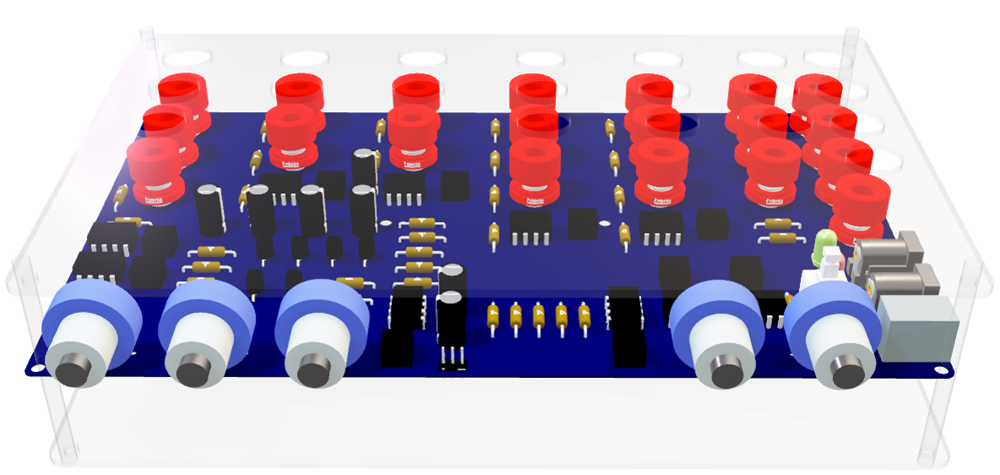

# Analog-Computer

## Project Overview

The Analog Computer project aims to design and implement a functional analog computer using various electronic components such as operational amplifiers, that can perform addition, subtraction, multiplication, integration, and differentiation. The project includes detailed simulations, PCB design files, and comprehensive documentation outlining the system design, component specifications, and testing procedures.

## Project Structure

The project is organized into several directories, each containing different components of the analog computer:

- **Simulations**: Contains various simulation files for different components and configurations of the analog computer.
  - **Adder Subtractor**: Simulations for adder and subtractor circuits.
  - **Multiplier**: Simulations for different types of multipliers including opamp multipliers, Gilbert cell multipliers, and more.
  - **Power Supply**: Simulations for power supply circuits.
- **PCB Design**: Contains files related to the PCB design of the analog computer.
  - **Analog_Computer**: Main directory for the PCB design files.
    - **ActiveBOM.BomDoc**: Bill of materials document.
    - **Analog_Computer.PrjPcb**: Project file for the PCB design.
    - **Analog_Computer.PrjPcbStructure**: Structure file for the PCB project.

## Getting Started

To get started with this project, you will need to have the following software installed:

- **LTspice**: For running the simulation files.
- **Altium Designer**: For viewing and editing the PCB design files.

### Running Simulations

Before running simulations, ensure the LM747 operational amplifier model file, located in the resources folder of this repository, is added to LTspice.

1. Open LTspice.
2. Navigate to the Simulations directory.
3. Open any of the `.asc` files to view and run the simulations.

### Viewing PCB Designs

1. Open Altium Designer.
2. Navigate to the `PCB Design/Analog_Computer` directory.
3. Open the `.PrjPcb` file to view the PCB design.

## Project Components

### Adder Subtractor

Contains simulation files for adder and subtractor circuits. These circuits are fundamental building blocks in analog computing.

### Multiplier

Contains various types of multipliers including:

- **Opamp Multiplier**: Uses operational amplifiers to perform multiplication.
- **Gilbert Cell Multiplier**: A type of analog multiplier circuit. (For the implementation of the circuit we ahve used the Gilbert Cell Multiplier circuit)

### Power Supply

Contains simulation files for power supply circuits which are essential for powering the analog computer.

### PCB Design

Contains the design files for the printed circuit board (PCB) of the analog computer. This includes the schematic, layout, and bill of materials.
## Circuit Demonstration (video)

## License

This project is licensed under the MIT License. See the LICENSE file for details.

## Contact

For any questions or inquiries, please contact naveensanjayab@gmail.com, himasha2k2@gmail.com, keshawa36@gmail.com or pasindudarshana2003@gmail.com

## Acknowledgements

- [LTspice](https://www.analog.com/en/design-center/design-tools-and-calculators/ltspice-simulator.html)
- [Altium Designer](https://www.altium.com/altium-designer/overview)
